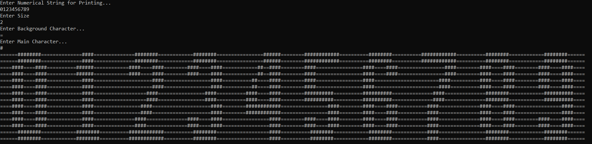
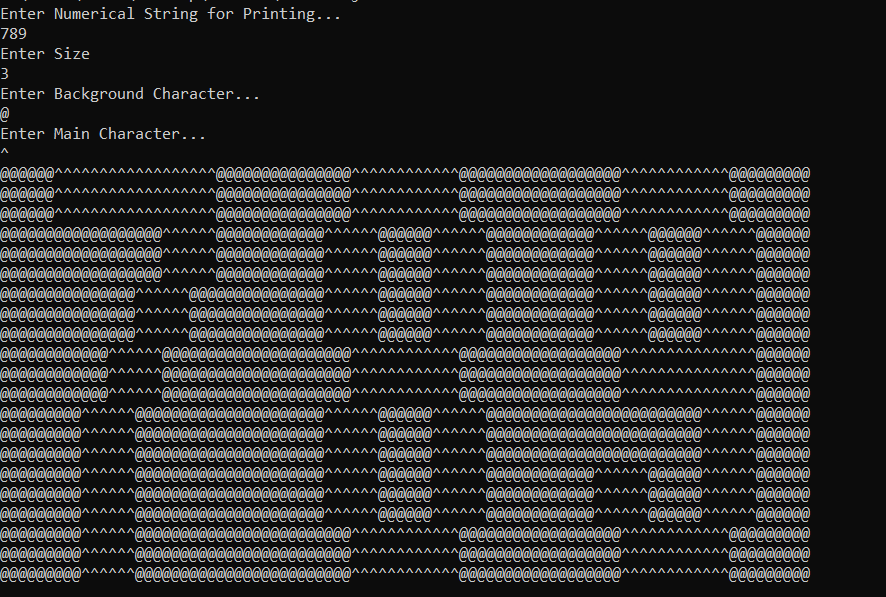
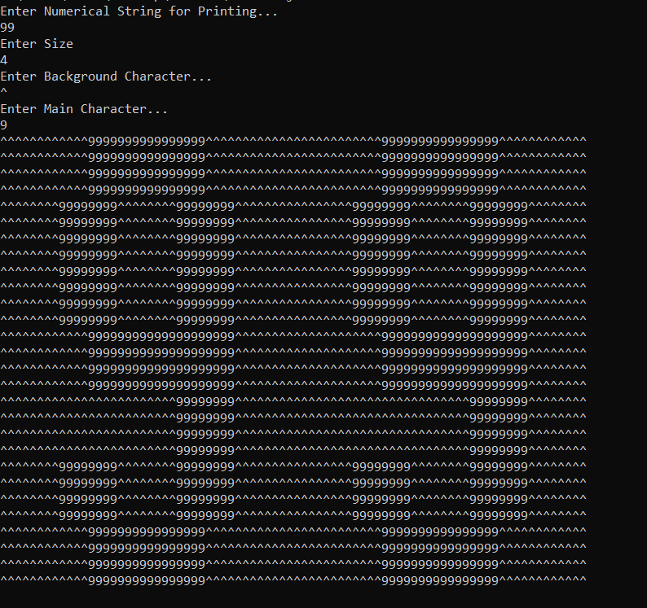

# Printer

##### Project Printer is all about printing numerical strings in different size and characters with custom background. The project is completely developed on Java.

##### How to run project Printer?

##### Before running project on your machine, make sure Java is installed in it or else download the latest version of it. Now, Open Commond Prompt or Terminal and navigate to Printer folder, type following command: 

##### -> javac Printer.java
##### -> java Printer

##### Then, give sample input and then you will be able to see corresponding output 

### ScreenShots:

